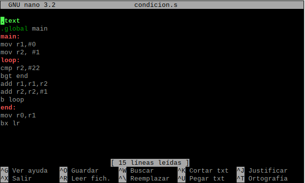

### Ejemplo2 utilizando la condición GT.

Vamos a sumar todos los números del 1 al 22.
El resultado de la suma es 253.
``` asm
 /* -- loop01.s 
.text
.global main
main:
mov r1, #0 @ r1 <- 0
mov r2, #1 @ r2 <- 1
loop:
cmp r2, #22 @ compare r2 and 22
bgt end @ branch if r2 > 22 to end
add r1, r1, r2 @ r1 <- r1 + r2
add r2, r2, #1 @ r2 <- r2 + 1
b loop
end:
mov r0, r1 @ r0 <- r1
bx lr


```
De la siguiente manera se muestra el codigo en un archivo nano.



Al ejecutarse se muestra lo siguiente:


