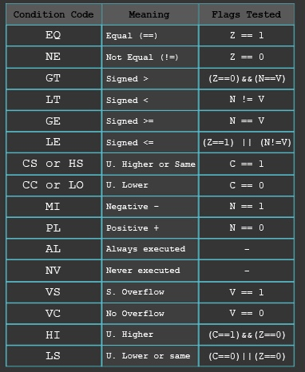

#    Tecnológico Nacional de México
#   Instituto Tecnológico de Tijuana
#        Subdirección Académica

# Departamento de Sistemas y Computación
# Ingeniería en Sistemas Computacionales
# Lenguajes de interfaz 

# Practica Bloque: Exposición.📝
# Objetivo: 
Crear una presentación sobre las instrucciones de ARM32 Posters.


# 📝 Apellidos, Nombres y Num Control
- Alonso Villegas Luis Antonio #18212139
- Estrada Gallegos Luis Humberto #17211520
- Hernández Fernández Diana #18210485
- Leal Oliva Carlos Fernando #18212205
- López Quiroz Manuel Antonio #18210494
- Salazar Felix Silvia Alejandra #18212266
- Zazueta Lopez Diana  #18210546


# Profesor:
# MC. René Solis Reyes
# Semestre sep - ene 2020

-----
  
    
    


Las instrucciones de salto pueden producir saltos incondicionales (b y bx) o saltos condicionales. Cuando saltamos a una etiqueta empleamos b, mientras que si queremos saltar a un registro lo hacemos con bx. La variante de registro bx la solemos usar como instrucción de retorno de subrutina, raramente tiene otros usos.
En los saltos condicionales añadimos dos o tres letras a la (b/bx), mediante las cuales condicionamos si se salta o no dependiendo del estado de los flags. Estas condiciones se pueden añadir a cualquier otra instrucción, aunque la mayoría de las veces lo que nos interesa es controlar el flujo del programa y así ejecutar o no un grupo de instrucciones dependiendo del resultado de una operación (reflejado en los flags).  
  
    
    




Descripción de las condiciones:
- **EQ (equal, igual).** Cuando Z está activo (Z vale 1).
- **NEQ (not equal, igual).** Cuando Z está inactivo (Z vale 0).
- **MI (minus, negativo).** Cuando N está activo (N vale 1).
- **PL (plus, positivo o cero).** Cuando N está inactivo (N vale 0).
- **CS/HS (carry set/higher or same, carry activo/mayor o igual).** Cuando C está activo (C vale 1).
- **CC/LO (carry clear/lower, carry inactivo/menor).** Cuando C está inactivo (C vale 0).
- **VS (overlow set, desbordamiento activo).** Cuando V está activo (V vale 1).
- **VC (overlow clear, desbordamiento inactivo).** Cuando V está inactivo (V vale 0).
- **GT (greater than, mayor en complemento a dos).** Cuando Z está inactivo y N=V (Z vale 0, N vale V).
- **LT (lower than, menor en complemento a dos).** Cuando N!=V (N vale not V).
- **GE (greater or equal, mayor o igual en complemento a dos).** Cuando N=V (N vale V).
- **LE (lower or equal, menor o igual en complemento a dos).** Cuando Z está activo y N!=V (Z vale 1, N vale not V).
- **HI (higher, mayor).** Cuando C está activo y Z inactivo (C vale 1, Z vale 0).
- **LS (lower or same, menor o igual).** Cuando C está inactivo ó Z activo (C vale 0 ó Z vale 1).

### Ejemplo 1:
Para el siguiente ejemplo utilizaremos la condicional **EQ**:

Primero vamos a crear un archivo .s: `nano comp.s`

Dentro de el se escribe el siguiente código:
``` asm
.text
.global main
main:
  mov r1, #5 /*r1=5*/
  mov r2, #5 /*r2=5*/
  cmp r1, r2 /*Compara r1 y r2*/
  beq igual /*Lo ejecuta sólo si Z=1*/
diferente:
  mov r0, #0  /*Si son diferentes mostrará 0*/
  b end
  
igual:  /*if*/
  mov r0, =1
end:
bx lr
```

Se ejecuta:

`as -o comp.o comp.s`

`gcc -o comp comp.o`

`./comp` o también: `./comp | echo $?`


### Ejemplo2 utilizando la condición GT.

Vamos a sumar todos los números del 1 al 22.
El resultado de la suma es 253.
``` asm
 /* -- loop01.s 
.text
.global main
main:
mov r1, #0 @ r1 <- 0
mov r2, #1 @ r2 <- 1
loop:
cmp r2, #22 @ compare r2 and 22
bgt end @ branch if r2 > 22 to end
add r1, r1, r2 @ r1 <- r1 + r2
add r2, r2, #1 @ r2 <- r2 + 1
b loop
end:
mov r0, r1 @ r0 <- r1
bx lr


```
De la siguiente manera se muestra el codigo en un archivo nano.


Al ejecutarse se muestra lo siguiente:


