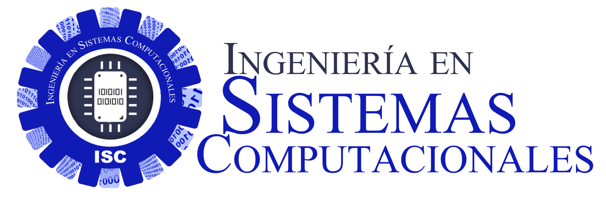
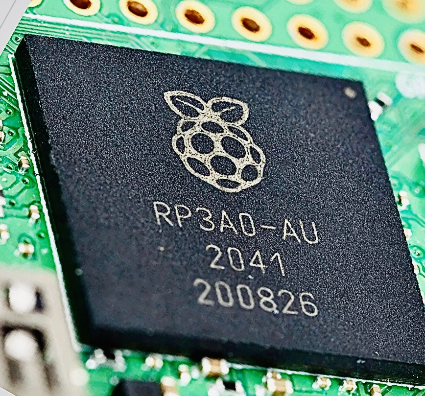

| Periodo         | (2024) ENERO-JUNIO                                                                                                                                                                                                                                                                                                                                                                                                                                                                                                                                                                                                                                                                                                                                                                                                                                                                                                                                                                                                                                                                                                                                                                               |
|-----------------|--------------------------------------------------------------------------------------------------------------------------------------------------------------------------------------------------------------------------------------------------------------------------------------------------------------------------------------------------------------------------------------------------------------------------------------------------------------------------------------------------------------------------------------------------------------------------------------------------------------------------------------------------------------------------------------------------------------------------------------------------------------------------------------------------------------------------------------------------------------------------------------------------------------------------------------------------------------------------------------------------------------------------------------------------------------------------------------------------------------------------------------------------------------------------------------------------------------------------------------------------------------------------------------------------------------------------------------------------------------------------------------------|
| Materia         | LENGUAJES DE INTERFAZ, Lunes a Jueves de 2-3pm y 3-4pm                                                                                                                                                                                                                                                                                                                                                                                                                                                                                                                                                                                                                                                                                                                                                                                                                                                                                                                                                                                                                                                                                                                                                                                                                                                                                           |
| Grupo           | SCC-1014SC6A y SCC-1014SC6C                                                                                                                                                                                                                                                                                                                                                                                                                                                                                                                                                                                                                                                                                                                                                                                                                                                                                                                                                                                                                                                                                                                                                                                                                                                                                                                                                                            |
| Caracterización | Esta asignatura aporta al perfil del Ingeniero en Sistemas Computacionales las siguientes habilidades: - Implementa aplicaciones computacionales para solucionar problemas de diversos contextos, integrando diferentes tecnologías, plataformas o dispositivos - Desarrolla y administra software para apoyar la productividad y competitividad de las organizaciones cumpliendo con estándares de calidad. - Coordina y participa en equipos multidisciplinarios para la aplicación de soluciones innovadoras en diferentes contextos. - Diseña e implementa interfaces para la automatización de sistemas de hardware y desarrollo del software asociado. La presente asignatura aporta los conocimientos para el diseño e implementación de interfaces hombre-máquina y máquina-máquina para la automatización de sistemas. El desarrollo, implementación y administración de software de sistemas o de aplicación que cumpla con los estándares de calidad con el fin de apoyar la productividad y competitividad de las organizaciones. Para que desempeñe sus actividades profesionales considerando los aspectos legales, éticos, sociales y de desarrollo sustentable y a la vez le permita poseer las habilidades metodológicas de investigación que fortalezcan el desarrollo cultural, científico y tecnológico en el ámbito de sistemas computacionales y disciplinas afines. |
| Objetivos       | Desarrollar software para establecer la interfáz hombre-máquina y máquina-máquina.                                                                                                                                                                                                                                                                                                                                                                                                                                                                                                                                                                                                                                                                                                                                                                                                                                                                                                                                                                                                                                                                                                                                                                                                                                                                                                         |

| Unidad 	| Competencia Especifica De la Unidad 	| Actividades de Aprendizaje 	| Actividades de Enseñanza 	| Desarrollo de Competencias Genéricas 	| Horas Teo-Pra 	| Criterios de Evaluación 	| Fuentes 	| Apoyos Didacticos 	| Eval 	| Núm. 	| Sem. 	|
|:-:	|:-:	|:-:	|:-:	|:-:	|:-:	|:-:	|-	|-	|-	|-	|-	|
|  	|  	|  	|  	|  	|  	|  	|  	|  	| Diag 	| Form 	| Suma 	|
| 01.Introducción al lenguaje ensamblador 	| - Conoce la arquitectura y organización de un procesador y la estructura de un programa en ensamblador e identifica la relación entre ambos. 	| - Investigar la estructura y organización de un procesador (CPU). Discutir y formalizar grupalmente lo investigado. - Analizar los registros más importantes que contiene un CPU, así como las funciones de los mismos. - Describir modos de direccionamiento a memoria y efectuar ejercicios. - Realizar ejemplos sencillos de cómo estructurar un programa fuente y que esté despliegue mensajes en el monitor con instrucciones básicas en lenguaje ensamblador 	| * Estar atento * No faltar a clase * Realizar las practicas propuestas en casa (y laboratorios) *Participación en clase preguntar cualquier duda * Apoyo al maestro en presentación de temas alternativos que ayuden al incremento del conocimiento de los estudiantes. Poseer habilidades de Análisis de problemas, e identificación de componentes de hardware asociadas al software. Utilizar algún lenguaje de programación de alto nivel. 	| Procesar e interpretar datos. Representar e interpretar conceptos en diferentes formas. Modelar fenómenos y situaciones. Pensamiento lógico, algorítmico, heurístico, analítico y sint�tico. Potenciar las habilidades para el uso de tecnologías de informaci�n. Resolución de problemas. Analizar la factibilidad de las soluciones. Optimizar soluciones. Toma de decisiones. 	| 10 	| Examen practico Lista de Cotejo Exposiciones Demostraciones 	| -Raspberry Pi Assembly Language Programming ARM Processor Coding (2019), Stephen Smith, APRESS.  -PRÁCTICAS DE ENSAMBLADOR BASADAS EN RASPBERRY PI, ANTONIO JOSÉ VILLENA GODOY UNIVERSIDAD DE MÁLAGA. -Assembly Language using the Raspberry Pi: A Hardware Software Bridge (2017) Robert Dunne. -Raspberry Pi Computer Architecture Essentials, Andrew K. Dennis (2016) 	| Internet, Apoyo con otros maestros para efecto de practicas, Paginas de tutoriales de Ensamblador 	| 00 	| 00 	| 00 	|
| 02.Programación básica 	| - Conoce y aplica instrucciones del lenguaje ensamblador, para programar aplicaciones de interfaz . 	| - Realizar investigación y listar las principales instrucciones de programación en lenguaje ensamblador. - Desarrollar programas por medio de prácticas en lenguaje ensamblador, los cuales ejemplifiquen las diferentes instrucciones y funciones básicas así como la forma de estructurarlas. 	| * Estar atento * No faltar a clase * Realizar las practicas propuestas en casa (y laboratorios) *Participación en clase preguntar cualquier duda * Apoyo al maestro en presentación de temas alternativos que ayuden al incremento del conocimiento de los estudiantes. Poseer habilidades de Análisis de problemas, e identificación de componentes de hardware asociadas al software. Utilizar algún lenguaje de programación de alto nivel. 	| Procesar e interpretar datos. Representar e interpretar conceptos en diferentes formas. Modelar fenómenos y situaciones. Pensamiento lógico, algorítmico, heurístico, analítico y sint�tico. Potenciar las habilidades para el uso de tecnologías de informaci�n. Resolución de problemas. Analizar la factibilidad de las soluciones. Optimizar soluciones. Toma de decisiones. 	| 18 	| Examen practico Lista de Cotejo Exposiciones Demostraciones 	| -Raspberry Pi Assembly Language Programming ARM Processor Coding (2019), Stephen Smith, APRESS.  -PRÁCTICAS DE ENSAMBLADOR BASADAS EN RASPBERRY PI, ANTONIO JOSÉ VILLENA GODOY UNIVERSIDAD DE MÁLAGA. -Assembly Language using the Raspberry Pi: A Hardware Software Bridge (2017) Robert Dunne. -Raspberry Pi Computer Architecture Essentials, Andrew K. Dennis (2016) 	| Internet, Apoyo con otros maestros para efecto de practicas, Paginas de tutoriales de Ensamblador 	| 00 	| 00 	| 00 	|
| 03.Modularización 	| - Aplica macros y procedimientos en el desarrollo de aplicaciones de software orientado a interfaz en lenguaje ensamblador. 	| - Realizar investigaciones sobre los conceptos macro y procedimiento, analizando sus semejanzas y diferencias. - Analizar el funcionamiento de un programa que no utiliza macros o procedimientos en su funcionamiento, todo esto utilizando un software que permita obtener datos estadísticos del funcionamiento de los programas en depuración. - Desarrollar programas en un lenguaje de programación que haga uso de macros o procedimientos, posteriormente analizar el funcionamiento interno de los programas desarrollados haciendo el uso del software que permita obtener datos estadísticos sobre el funcionamiento de los mismos. 	| * Estar atento * No faltar a clase * Realizar las practicas propuestas en casa (y laboratorios) *Participación en clase preguntar cualquier duda * Apoyo al maestro en presentación de temas alternativos que ayuden al incremento del conocimiento de los estudiantes. Poseer habilidades de Análisis de problemas, e identificación de componentes de hardware asociadas al software. Utilizar algún lenguaje de programación de alto nivel. 	| Procesar e interpretar datos. Representar e interpretar conceptos en diferentes formas. Modelar fenomenos y situaciones. Pensamiento lógico, algoritmico, heurístico, analítico y sintático. Potenciar las habilidades para el uso de tecnologías de información. Resolución de problemas. Analizar la factibilidad de las soluciones. Optimizar soluciones. 	| 21 	| Entregar las evidencias de prácticas por unidad y propuesta de proyecto final, avances 100% (30% por avance) 	| -Raspberry Pi Assembly Language Programming ARM Processor Coding (2019), Stephen Smith, APRESS.  -PRÁCTICAS DE ENSAMBLADOR BASADAS EN RASPBERRY PI, ANTONIO JOSÉ VILLENA GODOY UNIVERSIDAD DE MÁLAGA. -Assembly Language using the Raspberry Pi: A Hardware Software Bridge (2017) Robert Dunne. -Raspberry Pi Computer Architecture Essentials, Andrew K. Dennis (2016) 	| Internet, Apoyo con otros maestros para efecto de practicas, Paginas de tutoriales de Ensamblador 	| 00 	| 00 	| 00 	|
| 04.Programación de dispositivos 	| - Programar interfaces de software y hardware para la manipulación de puertos y dispositivos de computadora. 	| - Analizar el funcionamiento del buffer de video de una computadora, mediante la lectura en modo texto del mismo. - Desarrollar programas en lenguaje ensamblador para acceder a los dispositivos de almacenamiento de la computadora. - Diseñar una interfaz de hardware utilizando algún tipo de integrado programable (ej. Microcontrolador). - Diseñar una interfaz de software en algún lenguaje de programación para controlar la interfaz de hardware utilizando los puertos paralelos, seriales y USB de la computadora. 	| * Estar atento * No faltar a clase * Realizar las practicas propuestas en casa (y laboratorios) *Participación en clase preguntar cualquier duda * Apoyo al maestro en presentación de temas alternativos que ayuden al incremento del conocimiento de los estudiantes. Poseer habilidades de Análisis de problemas, e identificación de componentes de hardware asociadas al software. Utilizar algún lenguaje de programación de alto nivel. 	| Procesar e interpretar datos. Representar e interpretar conceptos en diferentes formas. Modelar fenómenos y situaciones. Pensamiento lógico, algorítmico, heurístico, analítico y sint�tico. Potenciar las habilidades para el uso de tecnologías de informaci�n. Resolución de problemas. Analizar la factibilidad de las soluciones. Optimizar soluciones. Toma de decisiones. 	| 16 	| Prototipo de proyecto final funcional documento terminado en formato APA 	| -Raspberry Pi Assembly Language Programming ARM Processor Coding (2019), Stephen Smith, APRESS.  -PRÁCTICAS DE ENSAMBLADOR BASADAS EN RASPBERRY PI, ANTONIO JOSÉ VILLENA GODOY UNIVERSIDAD DE MÁLAGA. -Assembly Language using the Raspberry Pi: A Hardware Software Bridge (2017) Robert Dunne. -Raspberry Pi Computer Architecture Essentials, Andrew K. Dennis (2016) 	| Internet, Apoyo con otros maestros para efecto de practicas, Paginas de tutoriales de Ensamblador 	| 00 	| 00 	| 00 	|

La presente asignatura aporta los conocimientos para el diseño e implementación de interfaces hombre-máquina y máquina-máquina para la automatización de sistemas. El desarrollo, implementación y administración de software de sistemas o de aplicación que cumpla con los estándares de calidad con el fin de apoyar la productividad y competitividad de las organizaciones. Para que desempeñe sus actividades profesionales considerando los aspectos legales, éticos, sociales y de desarrollo sustentable y a la vez le permita poseer las habilidades metodológicas de investigación que fortalezcan el desarrollo cultural, científico y tecnológico en el ámbito de sistemas computacionales y disciplinas afines.

Activación de Student Pack de GitHub.com, se hará la donación de miles de doalres de software de licencia pero las condiciones son **CUENTA DE CORREO INSTITUCIONAL**. 

Es requisito indispensable registrarse en GitHub utilizando un nombre de usuario que combine su apellido y nombre (ApellidoNombre). Además, se debe añadir una fotografía de perfil actual. Es importante destacar que GitHub implementa políticas de seguridad estrictas, incluyendo el bloqueo de la IP de su equipo después de tres intentos fallidos de acceso, para prevenir el abuso en la reiteración de intentos de inicio de sesión. Como plataforma profesional, se advierte de antemano sobre estas medidas para garantizar un uso adecuado.

Si ya posee una cuenta en GitHub con proyectos profesionales bajo su nombre de usuario actual, no es necesario realizar cambios. Sin embargo, si su cuenta contiene principalmente material académico que no afecta a terceros, le solicitamos amablemente que modifique su nombre de usuario para incluir la fotografía utilizada en el aula virtual. Asegúrese de que la cuenta esté asociada con su dirección de correo electrónico institucional (@tectijuana.edu.mx), aunque es posible vincular más de una dirección de correo electrónico a su perfil de GitHub.

Condiciones Académicas 

1. **Introducción Intensiva:** La primera semana del curso será particularmente intensiva, funcionando como un periodo de regularización para asegurar que todos los estudiantes se adapten al ritmo de trabajo propuesto. Este tiempo también nos permitirá identificar y potenciar las habilidades técnicas de cada participante.

2. **Formación de Equipos:** Los equipos de trabajo se formarán de manera aleatoria a través de GitHub Education Classroom, que además servirá como el repositorio principal para las prácticas. Es importante notar que la composición de los equipos no será permanente, permitiendo así diversas dinámicas de colaboración a lo largo del curso.

3. **Dinámica Semestral:** A partir de medio semestre, los lunes y miércoles se dedicarán exclusivamente a resolver dudas, mientras que los martes y jueves estarán enfocados al trabajo en equipo. Durante las sesiones, se proporcionará información detallada sobre la organización de cada semana.

4. **Certificación en C++:** Para la certificación en C++, se utilizará la plataforma SoloLearn, disponible para Android, iPhone y PC. Es necesario activarla con una cuenta personal para obtener al final un certificado validado mediante un enlace. Es crucial entender que no se tolerará la manipulación de certificados académicos.

5. **GitHub PRO:** Se activará una cuenta PRO en GitHub.com para cada estudiante, con un valor anual de $90 USD. Esta cuenta permitirá la presentación ilimitada de proyectos de desarrollo de software, tanto abiertos como cerrados, y facilitará la visibilidad y la indexación a nivel mundial. El objetivo es promover el perfil de cada estudiante en comunidades internacionales y fomentar oportunidades de vinculación y promoción.

6. **Figma para Educación:** Se invita a los estudiantes a utilizar Figma con una beca educativa valorada en $80 USD. Esta herramienta es ideal para la entrega de proyectos colaborativos académicos que no requieran código fuente.

7. **Código de Programación en GitHub GIST y Github Classroom:** Todo código de programación debe ser alojado en GitHub y seguir un formato específico para ser aceptado. Es fundamental que el estudiante se familiarice con este formato, ya que la presentación del código es tan importante como la solución propuesta en sí.

---

**EVALUACIÓN:**

1. **Uso de LOOM:** Es mandatorio que todos los estudiantes estén registrados en [LOOM.com](http://loom.com/education) y tengan activada la beca académica. Muchas comunicaciones y detalles se realizarán a través de grabaciones de pantalla o smartphone. Igualmente el uso de [Asciinema](https://asciinema.org/login/new) se requiere revisar detalladamente su procedimiento antes el nodo ARM cuando este compilando, etc.

2. **Presentación de Trabajos:** 
   - Todos los trabajos llevauna rúbrica (en forma de tabla, animacion o video de LOOM.com de ejemplos) y ser entregados a más tardar el viernes de cada semana, con previo aviso al grupo durante los horarios de clase.
   - Cada trabajo incluirá una rúbrica detallada que explicará cómo se compone la nota final sobre 100 puntos. Es importante prestar atención a los requisitos para maximizar la calificación.
   - Docencia he visto que los estudiantes no leen las instrucciones solo ven ejemplos y sobre estos elaboran sus bases pero estan desorientados causan fallos.

3. **Política de Entrega:**
   - Los trabajos no entregados recibirán una calificación de cero (0) y afectarán el promedio general.
   - Ceros notorios pasara el estudiante a exposiciones, y trabajo especifico asignado para recuperar el ritmo.
   - La fecha límite para la entrega semanal es el viernes durante el horario de clase. No se aceptarán trabajos tarde a menos que haya una justificación válida (como problemas de trabajo o salud), la cual debe ser comunicada de manera privada e idependientemente debe de hacerlos y entregarlos en fechas indicadas. 

4. **Retroalimentación:**
   - Se ofrecerá retroalimentación principalmente a través de GitHub Classroom donde fue depositada la actividad, ejercicio, etc. 

5. **Evaluación del Curso:**
   - Hay exámenes temáticos, prácticas, tareas. La calificación final de cada tema será el promedio de todas las tareas entregadas con una ponderacion que se atendera en su momento por el grupo.
   - Es obligatorio completar al menos una tarea por tema, de lo contrario, se deberá presentar un examen de recuperación.
   - Algunas practicas no contarán para la evaluación directa pero servirán como refuerzo del tema y deben ser completadas, como CHECKLIST o Lista de Cotejo.

6. **Proyecto Final (por checarlo):**
   - El curso culmina con un proyecto documental, dividido en dos etapas, cada una valorada en un 50% del total. Se utilizará GitHub Projects para organizar y dar transparencia al proceso.

---

Esta versión busca ser más directa y organizar la información de manera que sea más accesible y fácil de seguir para los estudiantes y docentes.

REQUISITOS DE HARDWARE:
- SmartPhone,PC o Laptop, tableta con AppStore-Google Play con TERMIUS.App igualmente VSCode para Windows, Mac o Linux
- Sistemas Operativo 64 bits, recomendable DualBoot con Linux con 20Gb o mas (ubuntu, Debian, etc) o también puede ser un USB 3.0 Bootable con persistencia de unos 6 Gb ver http://pendrivelinux.com con software de Termius instalado entre otros.
- Necesaria contar con MicroControlador RaspberryPi "PICO W" este se organizan los estudiantes y se hara una "propuesta" a el grupo para adquirirlo por volumen de fabrica al costo, junto con material de GitHub Education y sticker del PIN-OUT.
- Raspberry PICO W sera el centro de atención de las practicas de dia a dia en ARM Assembly 32bit, por ser hardware libre esta bien documentada y apoyada con un inmensa comunidad, considere esta opción si otro MCU competente dedide cambiarlo y entrará a trabajar en su materia.
- Para apoyar a el grupo se conectara una RaspberryPI5 8gb RAM 128Gb ssd en una IP estática para que se conecten a esta para las practicas complementarias con Kernel de Linux, igualmente en 32 bits
- Trabajaremos con ARM32 en microcontrolador Raspberry PicoW en Assembly un poco y cerramos el semestre con C.
- Smartphone con APP de SSH que se activará con TERMIUS (de su Github student pack) con un valor de $30 dlls gratis para UD durante un año que brinda la compañia.

Sin otro particular estoy a sus ordenes.

<!-- Escalar una imagen 200x200 -->

MC. René Solis R.

Redes Sociales:
- Twitter: @IoTeacher noticias mas activo al dia.
- FB: facebook.com/profesorsolis (noticias y marketplace)

----
# REGISTRO 2024a

Formulario de estudiantes 2024a

https://forms.gle/ViCfFPmKLUvCp5ch6

-----

