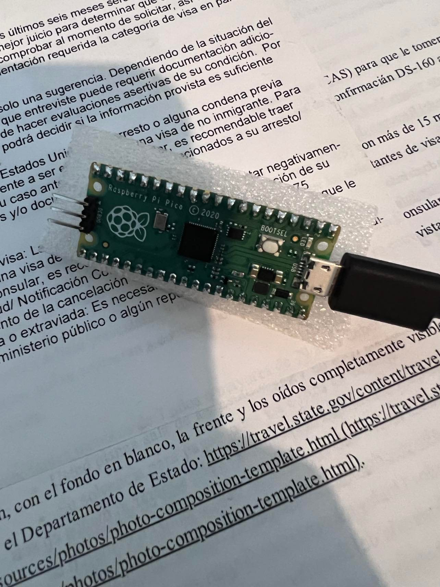
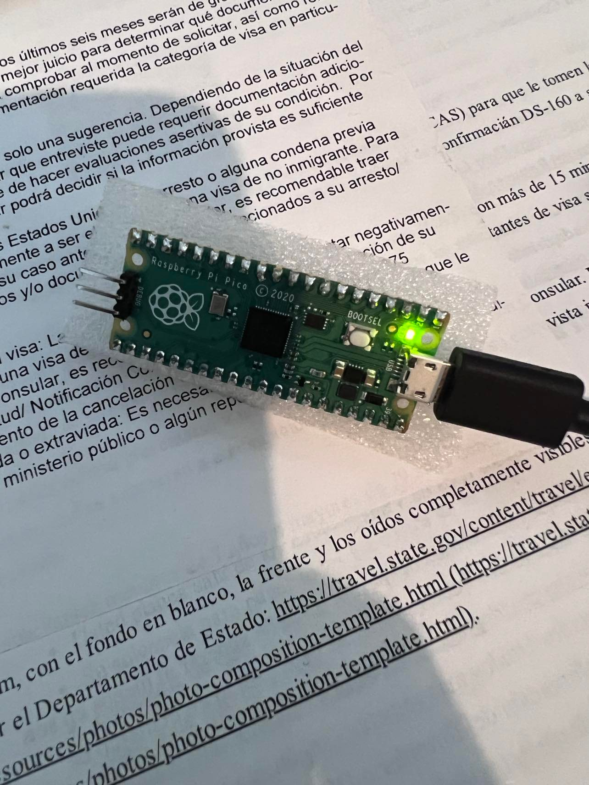
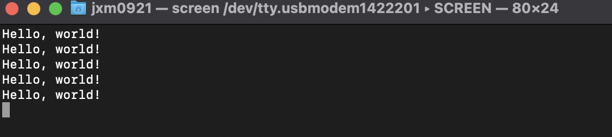

------

<pre>

	<p align=center>

Tecnológico Nacional de México
Instituto Tecnológico de Tijuana

Departamento de Sistemas y Computación
Ingeniería en Sistemas Computacionales

Semestre:
Febrero - Junio 2022

Materia:
Lenguajes de interfaz

Docente:
M.C. Rene Solis Reyes 

Unidad:
RP2040 PICO

Título del trabajo:
RaspberryPICO RP2040 C++ Básicos 

Estudiante:
Mejia Cruz Jose Eduardo - 18210500

	</p>

</pre>

---

# Pre steps -> Configuration on MacOS

### Ensure that all is congure propertly.
```
$ brew doctor
$ brew update
$ brew upgrade 
```
### Install the toolchain by using **Homebrew**
```
$ brew install cmake
$ brew tap ArmMbed/homebrew-formulae
$ brew install arm-none-eabi-gcc 
```
### cd into a directory where you want to store the files
```
$ git clone -b master https://github.com/raspberrypi/pico-sdk.git
$ cd pico-sdk
$ git submodule update --init
```

### Get the example code
```
$ cd ..
$ git clone -b master https://github.com/raspberrypi/pico-examples.git
```
---

# Compiling and running Blink
```
$ cd pico-examples
$ mkdir build
$ cd build
```
### Set the path to where the SDK can be found
```
$ export PICO_SDK_PATH=../../pico-sdk
```

### Get the build directory ready for cmake
```
$ cmake ..

$ cd blink
$ make -j4

[100%] Linking CXX executable blink.elf
[100%] Built target blink
```
You should now have a blink.uf2 file inside the build/blink directory

- Connect a Raspberry Pi Pico via USB to the Mac. Hold down BOOTSEL to get access to the storage.
- Drag the file named ```blink.uf2``` over to the attached drive named RPI-RP2.
- The drive will be disconnected and the blink program should start running that constantly flashes the LED.





---

# Build "Hello World"

### As we did for the previous "Blink" example, change directory into the hello_world directory inside the pico-examples/build tree, and run make.
```
$ cd hello_world
$ make -j4
Scanning dependencies of target ELF2UF2Build
[  0%] Creating directories for 'ELF2UF2Build'
.
   .
[ 33%] Linking CXX executable hello_usb.elf
[ 33%] Built target hello_usb
.
   .
[100%] Linking CXX executable hello_serial.elf
[100%] Built target hello_serial
```
This will build two separate examples programs in the hello_world/serial/ and hello_world/usb/ directories.

### Flash and Run "Hello World"

- Connect a Raspberry Pi Pico via USB to the Mac. Hold down BOOTSEL to get access to the storage.
- Drag the file named ```hello_usb.uf2``` over to the attached drive named RPI-RP2.
- The drive will be disconnected and the blink program should start running that constantly flashes the LED.

### Locate the port USB using to **printf**

1. Run ```ls /dev/tty.* ``` to list each serial conection 
2. Unplug the Pi Pico and run the same command as above to locate the port missing
3. Plug in Pi Pico again
4. Run the command screen ```[serial port located above]``` e.g. ```screen /dev/tty.usbmodem1422201```

A screen will promt up printing Hello, world! imediatitly. 


