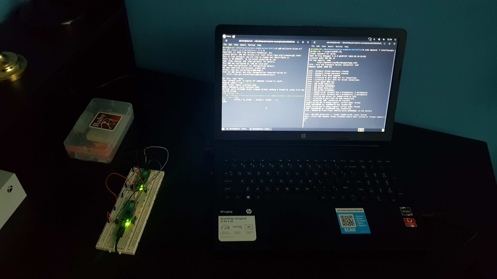
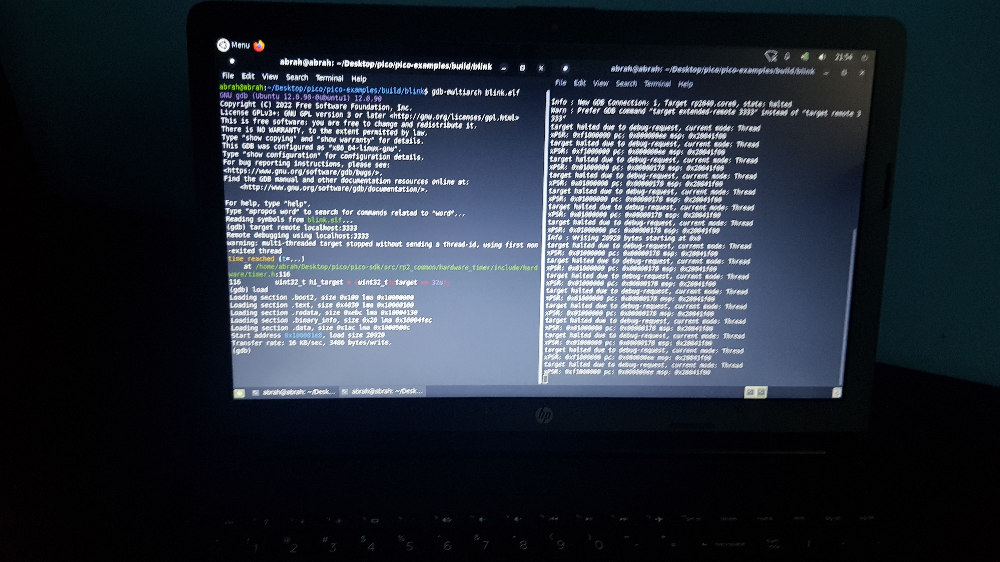
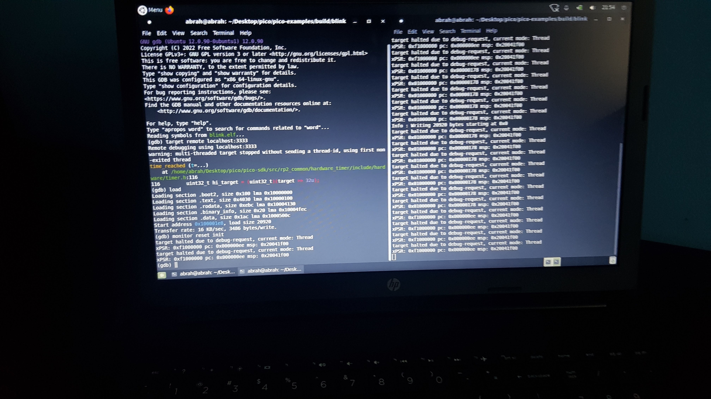
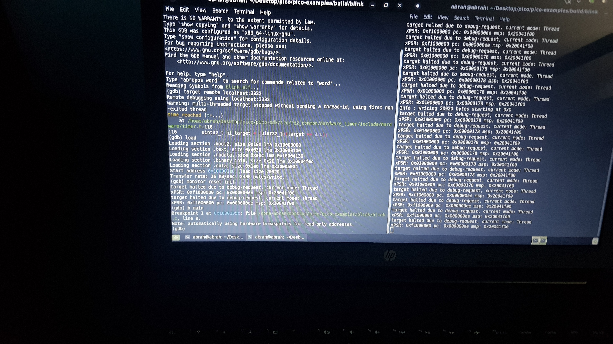
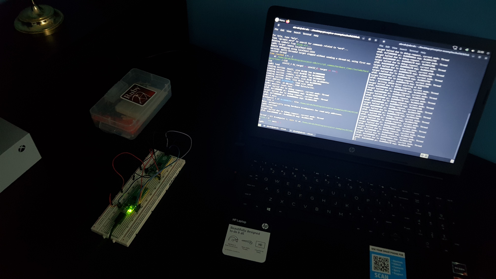

# 22apicoprobe-flores-deseusa

## Integrantes:
- Abraham Jhared Flores Azcona, 19211640
- Victor Manuel Sanchez Deseusa, 19211732

## Ejercicios realizados:
- Debugging de un programa mediante el uso de una Picoprobe para conectar a otra.

---

### Debugging de un programa mediante el uso de una Picoprobe para conectar a otra.

#### Evidencias:

[Video demostrativo](https://user-images.githubusercontent.com/99265478/169218303-9bec5522-f33a-4c3c-bf2d-a69b682d492e.mp4)

#### Comentarios:
Esta tarea ha sido una de las más laboriosas, ya que los entornos SDK en Linux requieren un cuidado extra durante las instalaciones. A pesar de contar con la ayuda del PDF adjunto, debemos admitir que se necesita una buena planeación para resolver el problema. Probamos los tres métodos propuestos, siendo el más efectivo el uso de OpenOCD y GDB en la terminal. Gracias a nuestra experiencia previa instalando Gentoo con un Distro LiveUSB, no tuvimos problemas para diagnosticar errores. Un desafío significativo fue el cableado, que resolvimos acomodando los cables jumpers de una manera que permitiera la comunicación entre los programas. Es curioso notar que es necesario abrir dos terminales para la comunicación por puerto serial durante el debugging.

---

## Conclusión:
Realizar actividades retadoras en entornos distintos a Windows nos ha permitido refinar nuestras habilidades generales en el manejo de la terminal, diagnóstico de problemas, y sobre todo, paciencia. Al ver el resultado de nuestro trabajo, nos damos cuenta que siempre hay una razón para no rendirse en estos procedimientos. A veces, lo más simple es lo que genera mayores problemas. Por eso, recomendamos realizar esta práctica con la mentalidad de que el éxito no necesariamente llegará en el primer intento.
