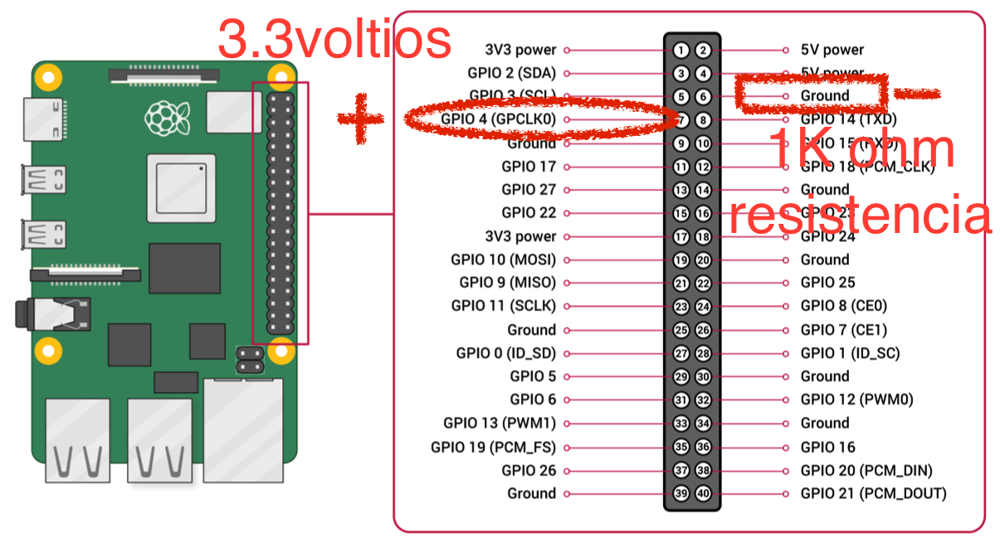
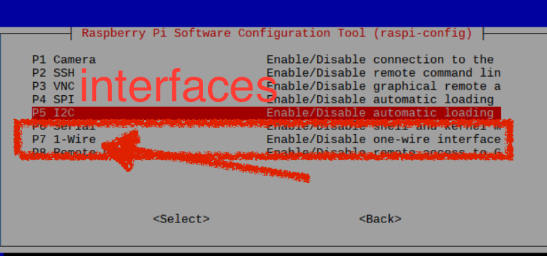
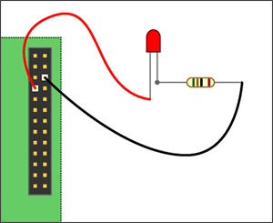

# LED blinking

# REQUISITOS

- Instalar "wiringPi" del Raspbian
- $ raspi-config, En la sección de INTERFACES cambiar el WiringPI  a "habilitado" 

````
sudo raspi-config
sudo apt-get install wiringpi
````






Este ejemplo está inspirado en esta página: http://www.thirdeyevis.com/pi-page-2.php, de la cual se toma la imagen de la derecha.

Este ejemplo requiere un cableado simple, usando un LED y una resistencia (1KOhm, típicamente) a 2 pines GPIO del encabezado RaspPi 2. Puede encontrar más información sobre la distribución de pines del conector GPIO aquí. El cable negro está conectado al pin 6 del cabezal (GND) y el cable rojo al pin 7 (BCM 4). Para ejecutar el código, también es necesario descargar la biblioteca wirePi, que se puede encontrar en esta página: http://wiringpi.com/examples/blink/.

```C
/* blink.c
   D. Thiebaut
   taken from https://www.raspberrypi.org/forums/viewtopic.php?f=33&t=23090
   blinks Physical Pin 7 On and Off, 10 times.

   to compile and run:
   gcc -o blink blink.c -lwiringPi
   sudo ./blink
*/

#include <wiringPi.h>
#include <stdio.h>
#include <stdlib.h>

int main ( void ) {
  int pin = 7;
  printf("Raspberry Pi wiringPi blink test\n");

  if (wiringPiSetup() == -1) {
    printf( "Setup didn't work... Aborting." );
    exit (1);
  }
  
  pinMode(pin, OUTPUT);

  int i;
  for ( i=0; i<10; i++ ) {
    digitalWrite(pin, 1);    
    delay(250);

    digitalWrite(pin, 0);
    delay(250);
  }

  return 0;
}
```

__Compile y ejecute de la siguiente manera:__
```bash
  gcc -o blink blink.c -lwiringPi
  sudo ./blink
```

Verifique que el código C anterior funcione antes de probar la versión ensamblada.

```asm
@ blink.s
@ D. Thiebaut
@ based on the following C program:
@	
@ #include <wiringPi.h>
@ #include <stdio.h>
@ #include <stdlib.h>
@ 
@ int main (void) {
@   int pin = 7;
@   printf("Raspberry Pi wiringPi blink test\n");
@ 
@   if (wiringPiSetup() == -1) {
@     printf( "Setup didn't work... Aborting." );
@     exit (1);
@   }
@   
@   pinMode(pin, OUTPUT);
@   int i;
@   for ( i=0; i<10; i++ ) {
@     digitalWrite(pin, 1);
@     delay(250);
@ 
@     digitalWrite(pin, 0);
@     delay(250);
@   }
@ 
@   return 0;
@ }
@	
@ To assemble, link, and run:
@
@  as -o blink.o blink.s 
@  gcc -o blink2 blink.o -lwiringPi 
@  sudo ./blink2 

@ ---------------------------------------
@	Data Section
@ ---------------------------------------
	
	 .data
	 .balign 4	
Intro: 	 .asciz  "Raspberry Pi wiringPi blink test\n"
ErrMsg:	 .asciz	"Setup didn't work... Aborting...\n"
pin:	 .int	7
i:	 .int	0
delayMs: .int	250
OUTPUT	 =	1
	
@ ---------------------------------------
@	Code Section
@ ---------------------------------------
	
	.text
	.global main
	.extern printf
	.extern wiringPiSetup
	.extern delay
	.extern digitalWrite
	.extern pinMode
	
main:   push 	{ip, lr}	@ push return address + dummy register
				@ for alignment

@  printf( "blink..." )	;
	ldr	r0, =Intro	
        bl 	printf		

@  if (wiringPiSetup() == -1) {
@     printf( "Setup didn't work... Aborting." ) ;
@     exit (1)					 ;
@  }
	bl	wiringPiSetup
	mov	r1,#-1
	cmp	r0, r1
	bne	init
	ldr	r0, =ErrMsg
	bl	printf
	b	done

@  pinMode(pin, OUTPUT)		;
init:
	ldr	r0, =pin
	ldr	r0, [r0]
	mov	r1, #OUTPUT
	bl	pinMode

@   for ( i=0; i<10; i++ ) {
	ldr	r4, =i
	ldr	r4, [r4]
	mov	r5, #10
forLoop:
	cmp	r4, r5
	bgt	done
	
@	digitalWrite(pin, 1) ;
	ldr	r0, =pin
	ldr	r0, [r0]
	mov	r1, #1
	bl 	digitalWrite
	
@       delay(250)		 ;
	ldr	r0, =delayMs
	ldr	r0, [r0]
	bl	delay

@       digitalWrite(pin, 0) 	;
	ldr	r0, =pin
	ldr	r0, [r0]
	mov	r1, #0
	bl 	digitalWrite

@       delay(250)		 ;
	ldr	r0, =delayMs
	ldr	r0, [r0]
	bl	delay

	add	r4, #1
	b	forLoop
	
done:	
        pop 	{ip, pc}	@ pop return address into pc
```

__Ensamble, vincule y ejecute de la siguiente manera:__
```bash
as -o blink.o blink.s
gcc -o blink2 blink.o -lwiringPi
sudo ./blink2
```

## Debe observar que el LED parpadea 10 veces a una frecuencia de 2 Hz (ON OFF ON OFF dura 1 segundo).
