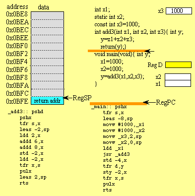

# PILA (stack) Y FUNCIONES


En esta parte veremos una región de memoria especial del proceso llamada **Pila** o STACK. El propósito de Stack y las operaciones relacionadas con él. Además, repasaremos la implementación, tipos y diferencias de funciones en ARM.

En términos generales, la **pila o STACK** es una región de memoria dentro del programa/proceso. Esta parte de la memoria se asigna cuando se crea un proceso. Usamos Stack para almacenar __datos temporales__ como variables locales de alguna función, variables de entorno que nos ayudan a hacer la transición entre funciones, etc. Interactuamos con la pila usando instrucciones **PUSH y POP**. Como se conoce que las instrucciones de memoria: cargar y almacenar PUSH y POP son alias de algunas otras instrucciones relacionadas con la memoria en lugar de instrucciones reales, pero usamos PUSH y POP por razones de simplicidad.

Antes de ver un ejemplo práctico, es importante que sepamos que Stack se puede implementar de varias maneras. Primero, cuando decimos que Stack crece, queremos decir que un elemento (32 bits de datos) se coloca en Stack. La pila puede crecer hacia ARRIBA (cuando la pila se implementa de forma descendente) o ABAJO (cuando la pila se implementa de forma ascendente). La ubicación real donde se colocará la siguiente información (32 bits) está definida por el **Stack Pointer** o **SP** (apuntador de la pila), o para ser precisos, la dirección de memoria almacenada en el _registro SP_. Aquí nuevamente, la dirección podría apuntar al elemento actual (último) en la pila o al siguiente espacio de memoria disponible para el elemento. Si el SP apunta actualmente al último elemento de la pila (implementación de la pila completa), el SP disminuirá (en el caso de la pila descendente) o aumentará (en el caso de la pila ascendente) y solo entonces el elemento se colocará en la pila. Si el SP apunta actualmente al siguiente espacio vacío en la pila, los datos se colocarán primero y solo entonces el SP disminuirá (pila descendente) o aumentará (pila ascendente).




```asm
// Basically Push() and Pop() as in stacks. Hmm, interesting stuff for me as a beginner.
// Basically Push() and Pop() as in stacks. Hmm, interesting stuff for me as a beginner.

.section __TEXT, __text
.global _main
.align 2

push {r7, lr}
mov r1, 0xB
pop{r7, pc}
```


# Generador de Aleatorios RANDOM
```c
//
//  Random.cpp
//  Random-int
//
//  Created by Rohit Navalgund on 17/04/18.
//  Copyright © 2018 Rohit Navalgund. All rights reserved.
//

// Uses C++'s inbuilt random() function to generate a random integer. This is a long integer (8bytes).
#include <iostream>
using namespace std;

class Randomiser {
public: long a; int n;

    void calc() {
        cout<<"How many random numbers do you want? ";
        cin>>n;
        for (int i = 0; i < n; i++) {
            a = random();
            cout<<a<<"\n";
        }
    }
};

int main() {
    Randomiser r;
    r.calc();
    return 0;
}
```
-----
# VERSION ASM usando el STACK (pila)

```asm
//@@ Instituto Tecnologico de Tijuana
//@@ Depto de Sistemas y Computación
//@@ Ing.En Sistemas Computacionales

//@@ Autor : Hernández Fernández Diana @DianaHFer
//@@ Repositorio: https://github.com/tectijuana/li20b3ej-4-DianaHFer(REPOSITORIO PRIVADO)
//@@ Fecha de revisión : Miercoles 01 de Diciembre del 2020.


//@ Objetivo del programa :

Ejemplo muy sencillo  del uso del stack de la cpu.
*/

// Basically Push() and Pop() as in stacks. Hmm, interesting stuff for me as a beginner.
// Basically Push() and Pop() as in stacks. Hmm, interesting stuff for me as a beginner.

//.section // __TEXT, __text
.global main

main:
     mov   r0, #2  /* set up r0 */
     push  {r0}    /* save r0 onto the stack */
     mov   r0, #3  /* overwrite r0 */
     pop   {r0}    /* restore r0 to it's initial state */
     bx    lr      /* finish the program */

```


# CORRIDA
````bash
tec@raspberrypi:~/profe $ nano stack.s
tec@raspberrypi:~/profe $ as -o stack.o stack.s
tec@raspberrypi:~/profe $ ld -o stack stack.o
ld: warning: cannot find entry symbol _start; defaulting to 00010054
tec@raspberrypi:~/profe $ ./stack
Segmentation fault
tec@raspberrypi:~/profe $ echo ?
?
tec@raspberrypi:~/profe $ echo $?
0
tec@raspberrypi:~/profe $
````
