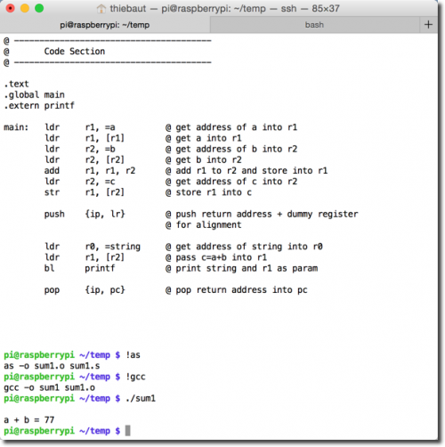

# Aritmética con variables enteras

```asm
@ sum1.s
@   D. Thiebaut
@   add 2 variables together
@	


@ ---------------------------------------
@	Data Section
@ ---------------------------------------
	
	.data
	.balign 4	
string: .asciz "\na + b = %d\n"
a:	.word	33
b:	.word	44
c:	.word 	0		@ will contain a+b 
	
@ ---------------------------------------
@	Code Section
@ ---------------------------------------
	
.text
.global main
.extern printf

main:	
        push 	{ip, lr}	@ push return address + dummy register
				@ for alignment

        ldr	r1, =a		@ get address of a into r1
	ldr	r1, [r1]	@ get a into r1
	ldr	r2, =b		@ get address of b into r2
	ldr	r2, [r2]	@ get b into r2
	add	r1, r1, r2	@ add r1 to r2 and store into r1
	ldr	r2, =c		@ get address of c into r2
	str	r1, [r2]	@ store r1 into c
	
	
        ldr 	r0, =string 	@ get address of string into r0
	ldr	r1, [r2]	@ pass c=a+b into r1
        bl 	printf		@ print string and r1 as param

        pop 	{ip, pc}	@ pop return address into pc
```


