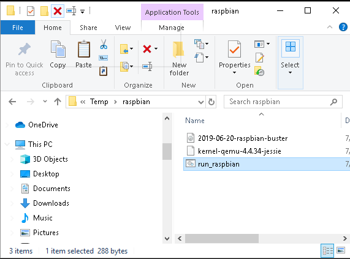
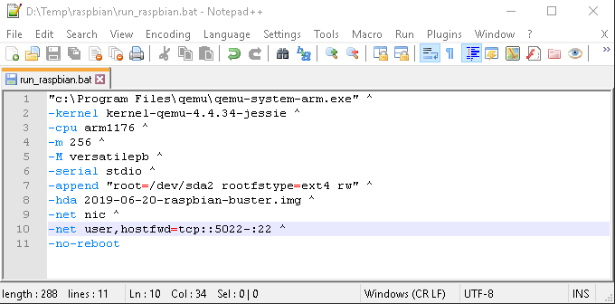
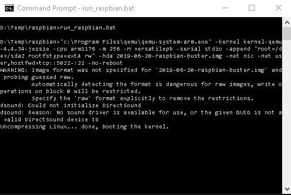
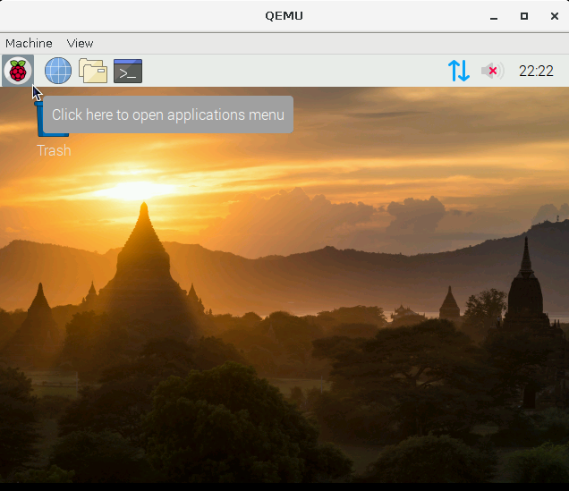

# Emulador para ARM32 de RaspberryPi 3


# macOS (Catalina)

## macos-qemu-rpi
Bash scripts para ejecutar Raspbian (arquitectura ARM) en macOS Catalina usando QEMU

## Instalación

Instale [homebrew] (https://brew.sh/), si aún no lo ha hecho.
A continuación, ejecute el siguiente script:

```bash
chmod +x install.sh
sudo ./install.sh
```

## Correr Raspbian en QEMU

```bash
chmod +x run.sh
sudo ./run.sh
```

Este script no requiere macOS, pero la imagen / kernel de Raspbian y QEMU son necesario.

Tenga en cuenta que estos scripts reenvían el puerto TCP / 5022 en el host (por ejemplo, macOS) al puerto
TCP / 22 en el invitado Raspbian donde escucha el servidor SSH de Raspbian.
Para ejecutar Raspbian en QEMU, ninguna otra aplicación, incluido Raspbian, puede escuchar
puerto TCP / 5022 en el host.

## Logging a RaspbianOS

Inicie sesión a través de la ventana de QEMU o use SSH:
```bash
ssh pi@127.0.0.1 -p 5022
```

Para obtener un shell de root, ejecute lo siguiente:
```bash
sudo bash
```

## Apagado de RaspbianOS
Inicie sesión en Raspbian y luego ejecute `sudo halt` en el shell de Raspbian.

## Tutorial de GDB

Las instrucciones de configuración avanzada en Raspbian se proporcionan en
https://azeria-labs.com/debugging-with-gdb-introduction/

## Créditos

Los scripts de este repositorio se basan en
https://gist.github.com/hfreire/5846b7aa4ac9209699ba#gistcomment-3075728.
El crédito es para @janwillemCA, @tinjaw y los otros contribuyentes de ese GitHub
esencia.


---------

# Windows  10, 64 bits

Instale QEMU para Windows 10 de 64 bits
Vaya al siguiente sitio web https://www.qemu.org/download/ y descargue el último instalador de QEMU para Windows de 64 bits.
```
Ejecute el instalador.

Los archivos ejecutables QEMU están instalados, p. Ej. C:\Archivos de programa\qemu\
```

#  Descarga un kernel de Linux
```
Vaya al siguiente sitio web https://github.com/dhruvvyas90/qemu-rpi-kernel y descargue un kernel adecuado, p. Ej. kernel-qemu-4.4.34-jessie

Coloque el archivo del kernel en una carpeta,  Ej. D: /Temp/raspbian/kernel-qemu-4.4.34-jessie
```

#  Descargar una imagen del sistema operativo Raspbian
1. Vaya al siguiente sitio web http://downloads.raspberrypi.org/raspbian/images/ y descargue la última imagen, _p.Ej.2019-06-20-raspbian-buster.zip_
2. Descomprima el archivo de imagen en una carpeta, _p.Ej./Temp/raspbian/2019-06-20-raspbian-buster.img_


# Crear un archivo bat de Windows
- Ejecute un editor de texto.
- Escriba las siguientes líneas.
**NOTA** cambie el nombre del kernel y de los archivos de imagen **(kernel-qemu-4.4.34-jessie)** para que coincidan con los nombres de los archivos descargados.
```
"c:\Program Files\qemu\qemu-system-arm.exe" ^
-kernel kernel-qemu-4.4.34-jessie ^
-cpu arm1176 ^
-m 256 ^
-M versatilepb ^
-serial stdio ^
-append "root=/dev/sda2 rootfstype=ext4 rw" ^
-hda 2019-06-20-raspbian-buster.img ^
-net nic ^
-net user,hostfwd=tcp::5022-:22 ^
-no-reboot

```

- Guardar como un archivo bat, p. Ej. run_raspbian.bat y cierre el editor.



# Ejecutar QEMU
Abre un símbolo del sistema.
 
Cambie el directorio a la carpeta que contiene el núcleo y los archivos de imagen, cambie la ruta segun sea pertinente
Escriba el comando:
```
C:\> run_raspbian.bat
```


Aparece la ventana QEMU ejecutando Raspbian OS




-------

# Linux OS 

## 1. Pasos para cargar en Linux


## 2. Prepara el OS de usuario actualizando
```bash
sudo apt update
sudo apt upgrade
```

## 3. Instalar qemu y unzip
```bash
sudo apt install qemu-system unzip
```

## 4. Imagen de Debian Linux y  el  kernel
El archivo kernel esta mantenido al dia en : https://github.com/dhruvvyas90/qemu-rpi-kernel

```bash
mkdir rpi
wget http://director.downloads.raspberrypi.org/raspbian_lite/images/raspbian_lite-2019-07-12/2019-07-10-raspbian-buster-lite.zip
unzip -d rpi 2019-07-10-raspbian-buster-lite.zip
wget -P rpi https://github.com/dhruvvyas90/qemu-rpi-kernel/raw/master/versatile-pb.dtb
wget -P rpi https://github.com/dhruvvyas90/qemu-rpi-kernel/raw/master/kernel-qemu-4.14.79-stretch

```

## 5. Descargar  dependencias
```bash
wget -P app/common -i requirements.txt

wget -P app/lib https://github.com/AndrewFromMelbourne/raspidmx/raw/master/lib/Makefile
```

## 6. Ejecutar la RaspbianOS
```bash
qemu-system-arm \
   -kernel rpi/kernel-qemu-4.14.79-stretch \
   -dtb rpi/versatile-pb.dtb \
   -m 256 -M versatilepb -cpu arm1176 \
   -serial stdio \
   -append "rw console=ttyAMA0 root=/dev/sda2 rootfstype=ext4  loglevel=8 rootwait fsck.repair=yes memtest=1" \
   -drive file=rpi/2019-07-10-raspbian-buster-lite.img,format=raw \
   -net user,hostfwd=tcp::5022-:22,vlan=0 \
   -net nic,vlan=0 \
   -no-reboot
```

## 7. Habilitar SSH Raspberry Pi terminal - enable ssh
```bash
raspberrypi login: pi
Password: raspberry 
sudo systemctl enable ssh
sudo systemctl start ssh
```

## 8. Para copiar via SCP seria este formato:
```bash
scp -r -P 5022 ./ArchivosACopiar/* pi@localhost:/home/pi
```

-------


# Emulador para ARM32 de RaspberryPi 3


Referencia 1: https://thinkingeek.com/2013/01/09/arm-assembler-raspberry-pi-chapter-1/
Referencia 2: http://bob.cs.sonoma.edu/IntroCompOrg-RPi/intro-co-rpi.html
