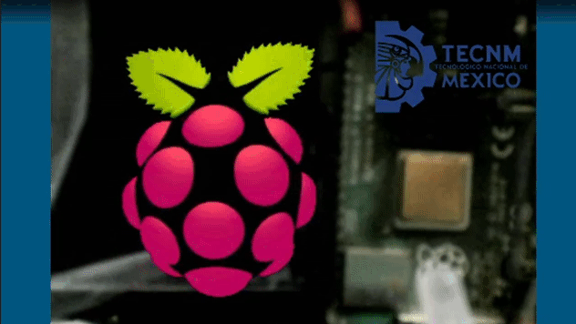

# WIRING (PROCESSING)

**Wiring** es una plataforma de prototipado electrónico de fuente abierta compuesta de un lenguaje de programación, un entorno de desarrollo integrado (IDE), y un microcontrolador. Ha sido desarrollado desde 2003 por Hernando Barragán. https://es.wikipedia.org/wiki/Wiring


# PRACTICA PI-LED 


------

## WiringPi.h Wiring
La biblioteca WiringPi usa la numeración GPIO (son las siglas de GPIO (General-purpose input/output):


Puede encontrar el pinout escribiendo:

```bash
gpio readallCopy
```


## Código base para encender un LED con Raspberry Pi


# Blinking LED en C++

Una vez instalada la biblioteca, puede escribir un programa utilizando las mismas palabras clave que Arduino, además de la función main () y las funciones básicas incluidas.

```cpp
//
// blinky.cpp
//
//
#include <iostream>
#include <wiringPi.h>
using namespace std;

int ledPin = 29;  //Corresponde a pin 40

void setup(){

        pinMode(ledPin,OUTPUT);
        cout << "                         " << endl ;    
        cout << "            .──Λ──.     " << endl ; 
        cout <<"          ,'  ╱◯╲  `.   " << endl ; 
        cout <<"         ;   ╱◯◯◯╲   :  " << endl ; 
        cout <<"         ;  ╱◯◯◯◯◯╲  :  " << endl ; 
        cout <<"        ;  ╱◯◯◯Λ◯◯◯╲  : " << endl ; 
        cout <<"        │ ╱◯◯◯╱ ╲◯◯◯╲ │ " << endl ; 
        cout <<"        │▕◯◯◯▕   ◙◯◯◯▏│ " << endl ; 
        cout <<"        : ╲◯◯◯╲ ╱◯◯◯╱ ; " << endl ; 
        cout <<"         : ╲◯◯◯V◯◯◯╱ ;  " << endl ; 
        cout <<"         :  ╲◯◯◯◯◯╱  ;  " << endl ; 
        cout <<"          ╲  ╲◯◯◯╱  ╱   " << endl ; 
        cout <<"           `. ╲◯╱ ,'    " << endl ; 
        cout <<"             `─V─'      " << endl ; 
        cout <<"       ┌───────────────┐" << endl ; 
        cout <<"       │ Blink el LED  │" << endl ; 
        cout <<"       └───────────────┘" << endl ; 
         cout <<"                         " << endl ;
        cout<<"Hello World: este fue el demo del Blinky en C++" << endl;

}

void loop(){
        digitalWrite(ledPin,HIGH);
        delay(100);
        digitalWrite(ledPin,LOW);
        delay(100);

        cout<<"Blink el LED: Tarda 9 segundos en parpadear en el http://twitch.com/profesolis" << endl;
        exit(0);
}

int main(void)//(int argc, char **argv)
{
        if(wiringPiSetup()<0){
                cout<<"configuracion de la libreria WIRING fallo, o le falto correrlo en $sudo"<<endl;
                return 1;
        }
        setup();
        while(1){
                loop();
        }
        
        return 0;
}


```
----
# RESULTADO DEL DEMO A CONVERTIR A ENSAMBLADOR (solo verificar todo conectado)
```bash
led@raspberrypi:~/t $ g++ -Wall -o blinky blinky.cpp -lwiringPi
led@raspberrypi:~/t $ sudo ./blinky 
[sudo] password for led: 
                         
            .──Λ──.     
          ,'  ╱◯╲  `.   
         ;   ╱◯◯◯╲   :  
         ;  ╱◯◯◯◯◯╲  :  
        ;  ╱◯◯◯Λ◯◯◯╲  : 
        │ ╱◯◯◯╱ ╲◯◯◯╲ │ 
        │▕◯◯◯▕   ◙◯◯◯▏│ 
        : ╲◯◯◯╲ ╱◯◯◯╱ ; 
         : ╲◯◯◯V◯◯◯╱ ;  
         :  ╲◯◯◯◯◯╱  ;  
          ╲  ╲◯◯◯╱  ╱   
           `. ╲◯╱ ,'    
             `─V─'      
       ┌───────────────┐
       │ Blink el LED  │
       └───────────────┘
                         
Hello World: este fue el demo del Blinky en C++
Blink el LED: Tarda 9 segundos en parpadear en el http://twitch.com/profesolis
```
----


----
## BIBLIOGRAFIA Y ANEXOS:
https://es.wikipedia.org/wiki/Wiring
https://es.wikipedia.org/wiki/GPIO
https://github.com/WiringPi/WiringPi
https://www.aranacorp.com/es/programe-su-raspberry-pi-con-c-c/

# Instalar WiringPi 
Para controlar la E / S de la Raspberry Pi como las del microcontrolador Arduino, puede usar el cableado de la biblioteca wiringPi.h.
En una terminal, verifique que la biblioteca esté instalada escribiendo:

```bash
$ gpio -v
$ gpio readall
```
de no contar con el soporte de debemos copiar repositorio GIT:

```bash
cd
git clone https://github.com/WiringPi/WiringPi.git
```
compila la biblioteca:

```bash
cd ~/wiringPi
./build
```
