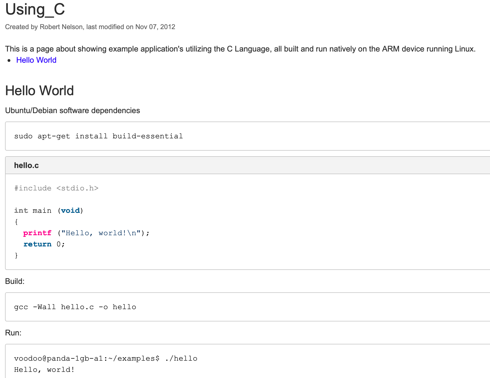

# Programa Hola Mundo en Leng. C y ARM Assembly

root@raspberrypi:/home/pi/revision# ls
holaMundoAssembler.s

root@raspberrypi:/home/pi/revision# as -o holaMundoAssembler.o holaMundoAssembler.s
root@raspberrypi:/home/pi/revision# ld -o holaMundoAssembler  holaMundoAssembler.o

root@raspberrypi:/home/pi/revision# ./holaMundoAssembler.s

Hello, world!

root@raspberrypi:/home/pi/revision# 
